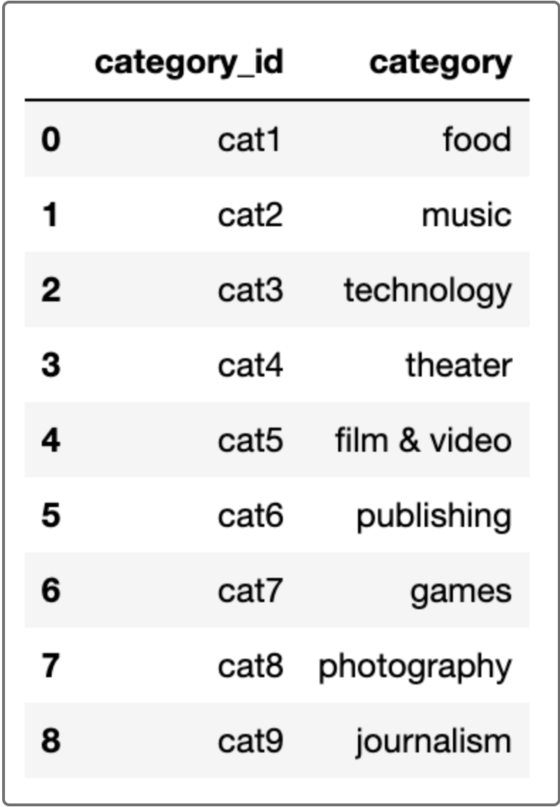
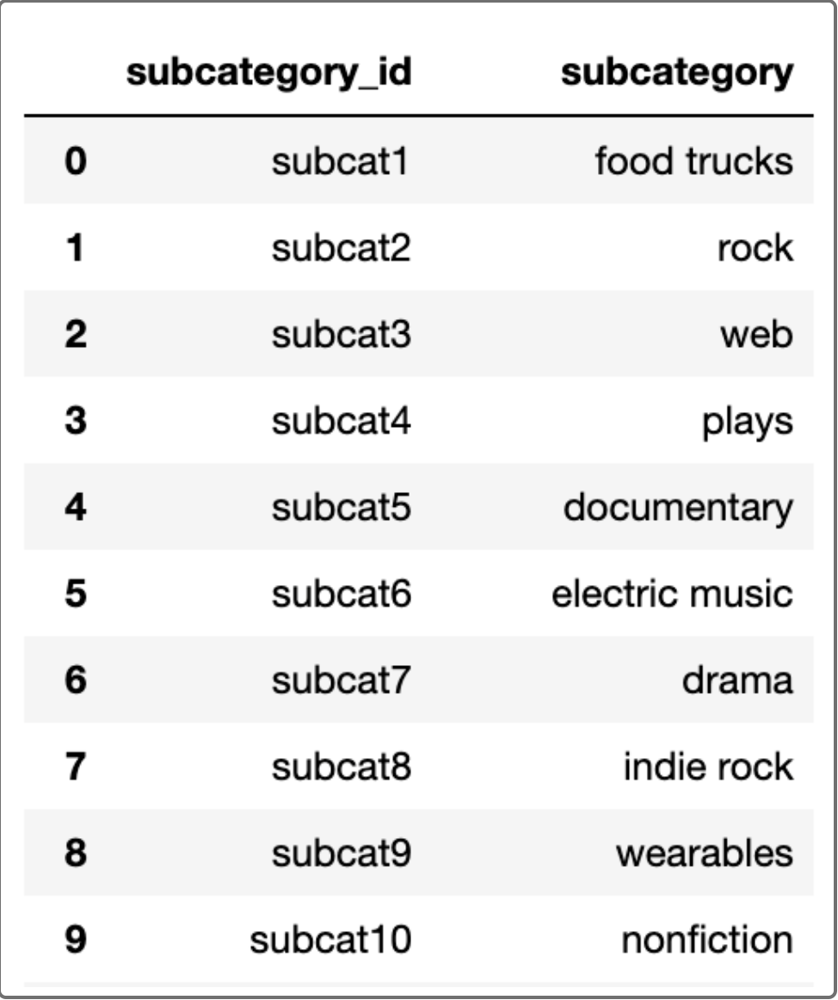
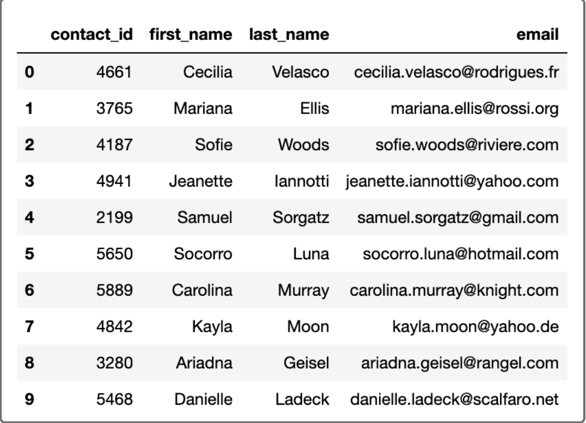

# project_2
Group 7:

- Andrew Oceguera
- Christopher Heng
- Jongwook choe
- Juliana Lima

The ETL mini project focuses on building an ETL pipeline using Python, Pandas, and Python dictionary methods or regular expressions. It involves extracting data, transforming it, creating four CSV files, creating an Entity-Relationship Diagram (ERD), and a table schema. The data is then uploaded into a Postgres database, enabling querying and analysis using SQL. The project provides hands-on experience in building an ETL pipeline, ensuring data accessibility and integration.

First, we started with two separate data files: "campaign.xlsx" and "contacts.xlsx". We wanted to clean and merge these datasets to create a consolidated dataset for further analysis.

For the "campaign.xlsx" file, we first loaded the data into a Pandas DataFrame called "campaign_df". We then performed several data cleaning steps, such as dropping irrelevant columns, handling missing values, and converting data types. We also formatted the "launched_date" and "end_date" columns to datetime format for easier manipulation. Next, we merged the "campaign_df" DataFrame with two additional DataFrames, "category_df" and "subcategory_df", based on common columns ("category" and "sub-category") to add more descriptive information.

Then, we focused on the "contacts.xlsx" file. We loaded the data into a DataFrame called "contact_info_df" and performed data cleaning steps. We extracted relevant information from the "contact_info" column using either JSON decoding or regular expressions. We extracted the "contact_id", "name", and "email" from the "contact_info" column and created a new DataFrame called "contact_info" containing these columns. We then further processed the data by splitting the "name" column into "first_name" and "last_name" columns.

To finalize the data preparation, we exported the cleaned and merged datasets as separate CSV files. The "campaign.xlsx" dataset was saved as "campaign.csv", while the "contacts.xlsx" dataset was saved as "contacts.csv".

By completing these steps, we successfully cleaned and merged the data from the two separate files, creating two separate CSV files that can be easily used for further analysis or integration with other systems.

## Instructions
The instructions for this mini project are divided into the following subsections:

* Create the Category and Subcategory DataFrames
* Create the Campaign DataFrame
* Create the Contacts DataFrame
* Create the Crowdfunding Database

## Create the Category and Subcategory DataFrames

1. Extract and transform the `crowdfunding.xlsx` Excel data to create a category DataFrame that has the following columns:

        * A "category_id" column that has entries going sequentially from "cat1" to "catn", where n is the number of unique categories

        * A "category" column that contains only the category titles

        * The following image shows this category DataFrame:

2. Export the category DataFrame as `category.csv` and save it to your GitHub repository.

3. Extract and transform the `crowdfunding.xlsx` Excel data to create a subcategory DataFrame that has the following columns:

        * A "subcategory_id" column that has entries going sequentially from "subcat1" to "subcatn", where n is the number of unique subcategories

        * A "subcategory" column that contains only the subcategory titles

        * The following image shows this subcategory DataFrame:

4. Export the subcategory DataFrame as `subcategory.csv` and save it to your GitHub repository.

## Create the Campaign DataFrame

1. Extract and transform the `crowdfunding.xlsx` Excel data to create a campaign DataFrame has the following columns:

* The "cf_id" column

* The "contact_id" column

* The "company_name" column

* The "blurb" column, renamed to "description"

* The "goal" column, converted to the `float` data type

* The "pledged" column, converted to the `float` data type

* The "outcome" column

* The "backers_count" column

* The "country" column

* The "currency" column

* The "launched_at" column, renamed to "launch_date" and with the UTC times converted to the `datetime` format

* The "deadline" column, renamed to "end_date" and with the UTC times converted to the `datetime` format

* The "category_id" column, with unique identification numbers matching those in the "category_id" column of the category DataFrame

* The "subcategory_id" column, with the unique identification numbers matching those in the "subcategory_id" column of the subcategory DataFrame

* The following image shows this campaign DataFrame:

2. Export the campaign DataFrame as `campaign.csv` and save it to your GitHub repository.

## Create the Contacts DataFrame

1. Choose one of the following two options for extracting and transforming the data from the `contacts.xlsx` Excel data:

        * Option 1: Use Python dictionary methods.

        * Option 2: Use regular expressions.

2. If you chose Option 1, complete the following steps:

* Import the `contacts.xlsx` file into a DataFrame.
* Iterate through the DataFrame, converting each row to a dictionary.
* Iterate through each dictionary, doing the following:
        * Extract the dictionary values from the keys by using a Python list comprehension.
        * Add the values for each row to a new list.
* Create a new DataFrame that contains the extracted data.
* Split each "name" column value into a first and last name, and place each in a new column.
* Clean and export the DataFrame as `contacts.csv` and save it to your GitHub repository.

3. If you chose Option 2, complete the following steps:

* Import the `contacts.xlsx` file into a DataFrame.
* Extract the "contact_id", "name", and "email" columns by using regular expressions.
* Create a new DataFrame with the extracted data.
* Convert the "contact_id" column to the integer type.
* Split each "name" column value into a first and a last name, and place each in a new column.
* Clean and then export the DataFrame as `contacts.csv` and save it to your GitHub repository.
* Check that your final DataFrame resembles the one in the following image:

## Create the Crowdfunding Database

1. Inspect the four CSV files, and then sketch an ERD of the tables by using QuickDBD.

2. Use the information from the ERD to create a table schema for each CSV file.

    Note: Remember to specify the data types, primary keys, foreign keys, and other constraints.

3. Save the database schema as a Postgres file named `crowdfunding_db_schema.sql`, and save it to your GitHub repository.

4. Create a new Postgres database, named `crowdfunding_db`.

5. Using the database schema, create the tables in the correct order to handle the foreign keys.

6. Verify the table creation by running a `SELECT` statement for each table.

7. Import each CSV file into its corresponding SQL table.

8. Verify that each table has the correct data by running a `SELECT` statement for each.
